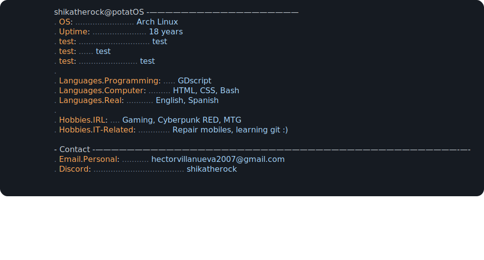

<!--
**ShikaTheRock/ShikaTheRock** is a ✨ _special_ ✨ repository because its `README.md` (this file) appears on your GitHub profile.

Here are some ideas to get you started:

- 🔭 I’m currently working on ...
- 🌱 I’m currently learning ...
- 👯 I’m looking to collaborate on ...
- 🤔 I’m looking for help with ...
- 💬 Ask me about ...
- 📫 How to reach me: ...
- 😄 Pronouns: ...
- ⚡ Fun fact: ...
-->

[%EF%BC%8F;%F0%9F%8E%A4+ShikaTheRock!!!!+%F0%9F%8E%B8;%09%D9%A9(%E2%97%95%E2%80%BF%E2%97%95%EF%BD%A1)%DB%B6;U+can+also+call+me+Shika+%3AD;%09(b+%E1%B5%94%E2%96%BD%E1%B5%94)b;Have+a+nice+day+%3AP;%E1%83%9A(%C2%AF%E3%83%AD%C2%AF%22%E1%83%9A))](https://git.io/typing-svg)

_**I might have born as a sorcerer, but i will die as a wizard🔮**_

Hiiiii :D, Im Shika a 18 year old spanish guy trying to learn ;)

Im using this git to document all my development all over the years, and on the way i learn git, whitch i think if i work as anything IT bassed i will have to use it 

Well, thats all, u can see my repos (Mostly school work). I HOPE U LIKE THEM 😁

<a href="https://github.com/ShikaTheRock/ShikaTheRock/tree/main">
  <picture>
    
  </picture>
</a>

